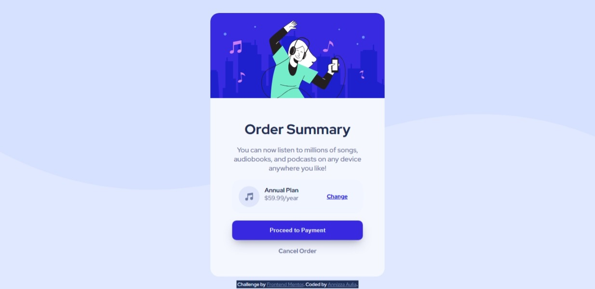

# Frontend Mentor - Order summary card solution

This is a solution to the [Order summary card challenge on Frontend Mentor](https://www.frontendmentor.io/challenges/order-summary-component-QlPmajDUj). Frontend Mentor challenges help you improve your coding skills by building realistic projects. 

## Table of contents

- [Overview](#overview)
  - [The challenge](#the-challenge)
  - [Screenshot](#screenshot)
  - [Links](#links)
  - [Built with](#built-with)
  - [Useful resources](#useful-resources)

## Overview
Hello! This is my solution for Order summary card solution task from Frontend Mentor.

### The challenge

Users should be able to:

- See hover states for interactive elements

### Screenshot




### Links

- [solution](https://www.frontendmentor.io/solutions/order-summary-card-gHLfc9J8KV)
- [live site](https://order-summary-component-powreze.netlify.app/)

### Built with

- Semantic HTML5 markup
- CSS custom properties
- Flexbox
- Mobile-first workflow

### Useful resources

- [css scan](https://getcssscan.com/css-box-shadow-examples) - I found this web randomly on google and it helps me to add a box shadow on my button using this css

```css
box-shadow: rgba(50, 50, 93, 0.25) 0px 13px 27px -5px, rgba(0, 0, 0, 0.3) 0px 8px 16px -8px;
```