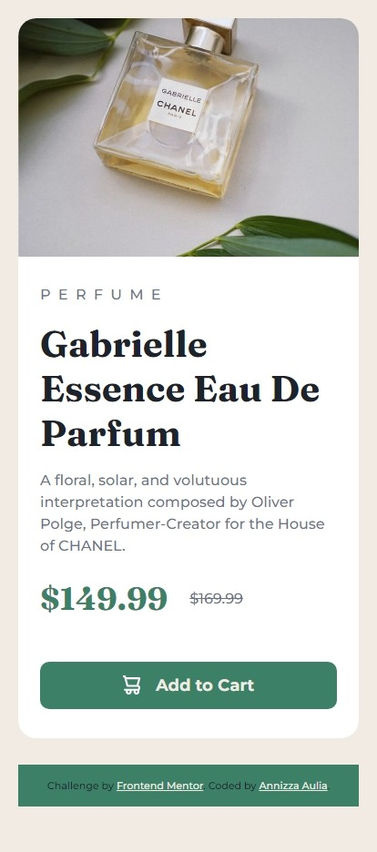

# Frontend Mentor - Product preview card component solution

This is a solution to the [Product preview card component challenge on Frontend Mentor](https://www.frontendmentor.io/challenges/product-preview-card-component-GO7UmttRfa). Frontend Mentor challenges help you improve your coding skills by building realistic projects. 

## Table of contents

- [Overview](#overview)
  - [The challenge](#the-challenge)
  - [Screenshot](#screenshot)
  - [Links](#links)
- [My process](#my-process)
  - [Built with](#built-with)
  - [What I learned](#what-i-learned)
  - [Continued development](#continued-development)
  - [Useful resources](#useful-resources)
- [Author](#author)
- [Acknowledgments](#acknowledgments)

## Overview
Hello everyone! this is my solution for Product Preview Card component challenge from Frontend Mentor.

### The challenge

Users should be able to:

- View the optimal layout depending on their device's screen size
- See hover and focus states for interactive elements

### Screenshot

### Links

- [solution](https://www.frontendmentor.io/solutions/product-preview-card-component--Ak1qyz_mt)
- [live site](https://product-preview-card-powreze.netlify.app/)

### Built with

- Semantic HTML5 markup
- CSS custom properties
- Flexbox
- Mobile-first workflow

### What I learned

In this task I learn more about putting a footer in my page since i didn't put it on my latest task. Sure it doesn't seem like a big progress but I feel satisfied when I saw that big block green below of the content. Hopefully I can learn more about frontend stuffs and build more task until I feel confident to build mine. Thanks to Frontend Mentor!