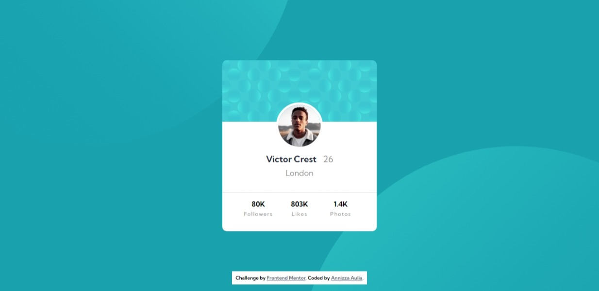
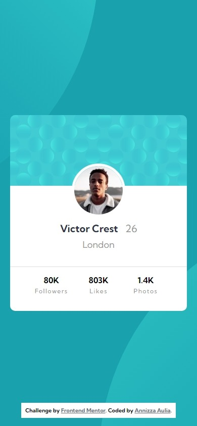

# Frontend Mentor - Profile card component solution

Hello everyone! Thank you for checking my solution. This is a solution to the [Profile card component challenge on Frontend Mentor](https://www.frontendmentor.io/challenges/profile-card-component-cfArpWshJ). Frontend Mentor challenges help you improve your coding skills by building realistic projects. 

## Table of contents

- [Overview](#overview)
  - [The challenge](#the-challenge)
  - [Screenshot](#screenshot)
  - [Links](#links)
- [My process](#my-process)
  - [Built with](#built-with)
  - [What I learned](#what-i-learned)

## Overview

### The challenge

- Build out the project to the designs provided

### Screenshot




### Links

- Solution URL: [solution](https://www.frontendmentor.io/solutions/profile-card-component-using-html-and-css-only--dQRN25QcU)
- Live Site URL: [preview](https://profile-card-component-powreze.netlify.app/)

## My process

### Built with

- Semantic HTML5 markup
- CSS custom properties
- Flexbox
- CSS Grid
- Mobile-first workflow


### What I learned

In this task I learn a few things.

First, I learn how to set the profile image on top of the background image and the next content. In my code I used

```css
position: absolute;
z-index: 10;
top: 6rem;
```
Second, I learn how to set the background using two image and color at the same time. In my code I used

```css
    background: var(--dark-cyan);
    background-image: url(/images/bg-pattern-top.svg), url(/images/bg-pattern-bottom.svg);
    background-repeat: no-repeat, no-repeat;
    background-position: right 50vw bottom 50vh, left 50vw top 50vh;
```
