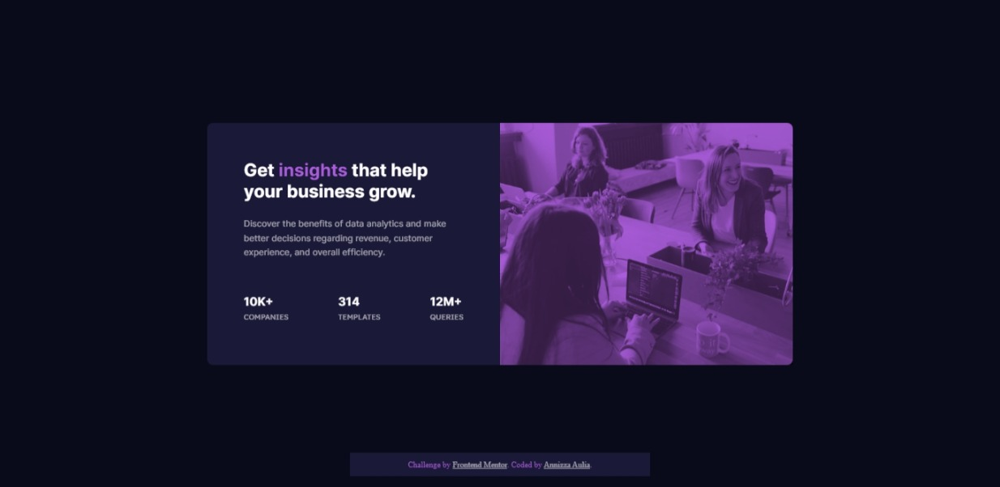

# Frontend Mentor - Stats preview card component solution

This is a solution to the [Stats preview card component challenge on Frontend Mentor](https://www.frontendmentor.io/challenges/stats-preview-card-component-8JqbgoU62). Frontend Mentor challenges help you improve your coding skills by building realistic projects. 

## Table of contents

- [Overview](#overview)
  - [The challenge](#the-challenge)
  - [Screenshot](#screenshot)
  - [Links](#links)
  - [Built with](#built-with)
  - [What I learned](#what-i-learned)

## Overview

Hello everyone! Thank you for checking my repository. Anyway, this is my solution for Stats Preview Card task from Frontend Mentor.

### The challenge

Users should be able to:

- View the optimal layout depending on their device's screen size

### Screenshot




### Links

- Solution URL: [Add solution URL here](https://your-solution-url.com)
- Live Site URL: [preview](https://stats-preview-card-powreze.netlify.app/)

### Built with

- Semantic HTML5 markup
- CSS custom properties
- Flexbox
- Mobile-first workflow

### What I learned

In this task, I have a trouble with adding different color in the image. I tried to add a div and set the position to absolute to make the div above of the image. Then I added a color and set opacity to make the image visible.

```css
background: hsl(295, 48%, 24%);
opacity: 0.7;
```